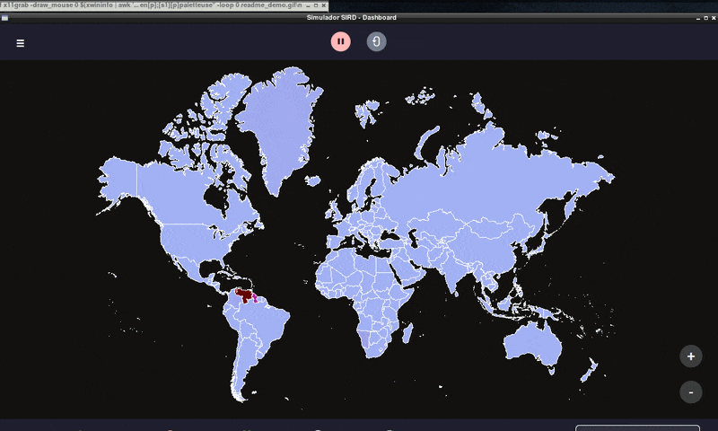
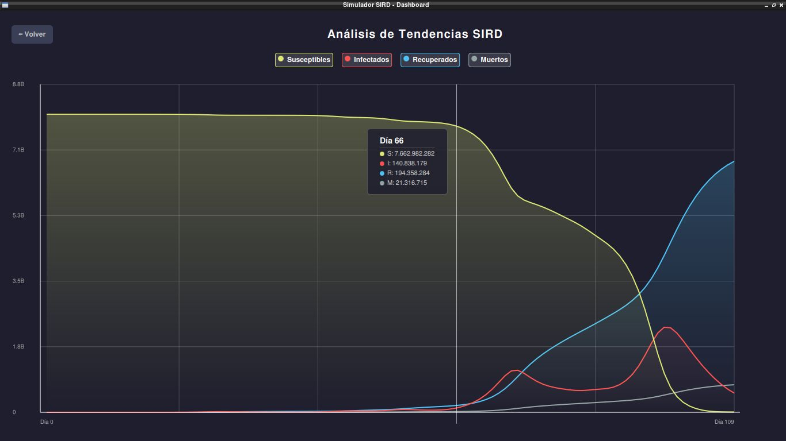

# 🌍 PaperPandemic: Simulador SIRD de Alto Rendimiento


> **Simulador epidemiológico en tiempo real optimizado para hardware limitado (Intel Atom / Single Core).** 


Combina un motor matemático vectorizado con una interfaz gráfica reactiva de alta velocidad **( QT/C++ )**.

<p align="center">
    
</p>


---

## Sobre el Proyecto

**PaperPandemic**  es un motor de simulación **SIRD (Susceptibles, Infectados, Recuperados, Fallecidos)** capaz de procesar la lógica de infección, logística (aeropuertos/puertos) y fronteras de **+200 países simultáneamente** sin congelar la interfaz de usuario.

El reto principal fue lograr opmitizar cientos de cálculos matemáticos complejos en un entorno de bajos recursos hasta alcanzar 60fps.


### Características Clave


* **Motor Matemático Vectorizado:** Lógica SIRD implementada con `Numpy` y `Pandas` para operaciones matriciales ultrarrápidas

* **Arquitectura MVC:** Separación entre Lógica (`backend/`), Control (`controllers/`) y Vista (`ui/QML`).

* **Simulación Logística:** Algoritmos de grafos para simular contagios por rutas aéreas, marítimas y fronteras terrestres.

* **Persistencia de Datos:** Sistema de guardado/carga automático usando **SQLite** y exportación de reportes a **CSV**.

* **Interfaz Reactiva:** Dashboard construido en **Qt Quick (QML)** con renderizado por GPU.




---


## 🔧 Optimización

Para garantizar la fluidez en hardware legacy, se implementaron las siguientes estrategias:


1.  **Cálculo Vectorial:** En lugar de iterar país por país, el estado del mundo se calcula como una matriz única.


    ```python
    # Ejemplo del código (backend/sir_model.py)
    # Cálculo masivo instantáneo usando operaciones vectorizadas
    # df (Dataframe con datos del mundo)
    # beta: Probabilidad de que una persona pase de sano a infectado
    # df["S"]: Sanos
    # df["I"]: Infectados
    sano_a_infectado = self.df["beta"] * self.df["S"] * self.df["I"] / (self.df["poblacion"] + 1)
    self.df["S"] -= sano_a_infectado
    ```
    
2.  **Gestión de Memoria QML:** Uso de `Loader` dinámico para destruir componentes gráficos (como el mapa) cuando no están en pantalla, liberando RAM y CPU.
3.  **Señales y Slots:** Comunicación asíncrona entre Python y la UI para evitar bloqueos del hilo principal.


---
## 📂 Estructura del Proyecto

```text
PaperPandemic/
├── backend/            # Lógica y Modelos Matemáticos
│   ├── engine.py       # Orquestador de la simulación
│   ├── sir_model.py    # Algoritmos SIRD vectorizados
│   └── data/           # Archivos SQLite y CSVs
├── controllers/        # Puentes entre Python y QML (Signals/Slots)
├── ui/                 # Interfaz Gráfica (QML/C++)
│   ├── components/     # Widgets reutilizables (Mapa, Gráficas)
│   └── themes/         # Gestor de Temas (Dark, Neon, etc.)
└── main.py             # Archivo Principal 

```


## Instalación y Uso


#### 1.Clonar el repositorio:

```
Bash
git clone [https://github.com/alejandroxyz/PaperPandemic.git](https://github.com/alejandroxyz/PaperPandemic.git)
cd PaperPandemic
```

#### 2. Instalar dependencias: Se recomienda usar un entorno virtual.


```
Bash
pip install -r requirements.txt
```


#### 3. Ejecutar:

```
Bash
python main.py
```


## 👤 Autor

Alejandro Moncada

[LinkedIn](https://www.linkedin.com/in/alejandroxyz/)

[GitHub](https://github.com/alejandroxyz)

[Gmail](mailto:alejandromdekuedit@gmail.com)


---

